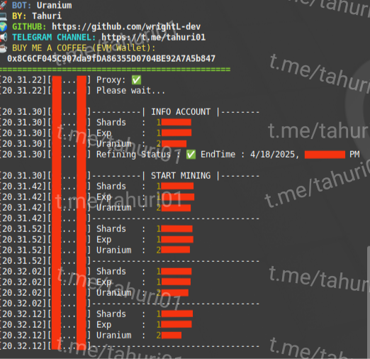

# BOT URANIUM



**Fitur:**

**• Single Account**

**• Auto Start Mining**

**• Auto Start & Complete Refining**

**• Supports Proxy w/o Proxy**

## Requirements

Before running this project, make sure you have installed:

- Node.js
- npm (Node Package Manager)
- npx

## Installation

1. **Clone this repository:**

    ```plaintext
    git clone https://github.com/wrightL-dev/URA
    cd URA

2. **Install the required packages:**

    ```plaintext
    npm install fs playwright cycletls readline form-data qs
    
3. **Install the required packages:**

    ```plaintext
    npx playwright install chromium

4. **Add your accounts in the wallet.txt file. Example:**

    ```plaintext
   0xxxx

5. **If you want to use a proxy, edit the proxy.txt file. Example:**
   ```plaintext
   http://username:password@ip:port
   
6. **Custom shards & exp, edit the config.json file.**

7. **Run the script:**
   ```plaintext
   node ura.js
   
## Support

If you have any questions or need further assistance, feel free to join our Telegram channel at [t.me/tahuri01](https://t.me/tahuri01).

## License

This project is licensed under the [MIT License](LICENSE).
